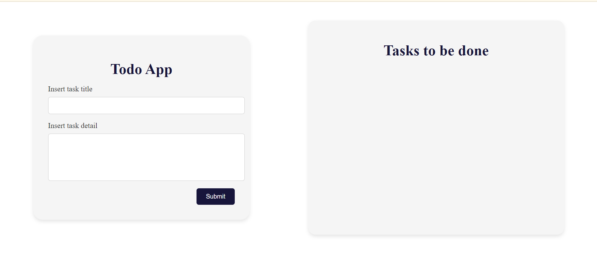

# Todo App

A simple and intuitive todo app built with React, CSS, Ant Design, and TypeScript.

## Features

- Add new tasks
- Mark tasks as complete or incomplete
- Edit existing tasks
- Delete tasks
- Responsive design for desktop and mobile
## images of the Todo App

## todo app

## task added

## deatil task
 
## edit page of a task

## Technologies Used

- **React**: A JavaScript library for building user interfaces
- **Ant Design**: A UI library of React components
- **TypeScript**: A superset of JavaScript that adds static typing
- **CSS**: For styling the application

## Installation

1. Clone the repository:
2. Navigate to the project directory:
3. Install the dependencies:
4. Start the development server:
## Usage

1. **Add a new task**: Click the "Add Task" button and enter a task description.
2. **Mark a task as complete/incomplete**: Click the checkbox next to a task to toggle its status.
3. **Edit a task**: Click the "Edit" button next to a task to modify its description.
4. **Delete a task**: Click the "Delete" button next to a task to remove it from the list.

## Contributing

Contributions are welcome! If you find any issues or have suggestions for improvements, please feel free to open an issue or submit a pull request.